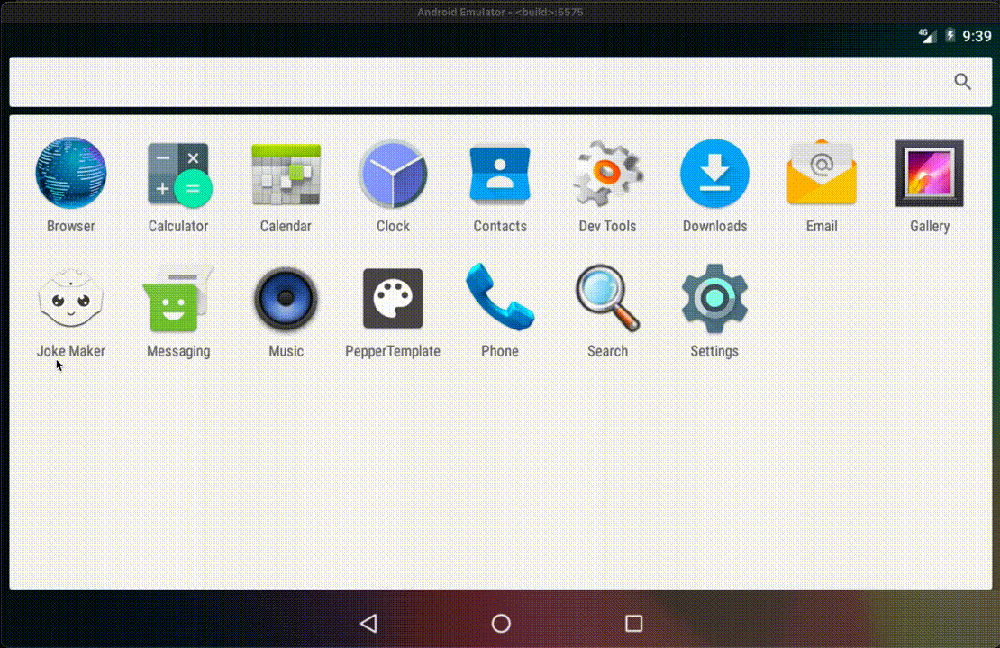

# Joke Maker

<!--  -->

It is an Android application for Pepper the robot.
It was developed using the QiSDK (https://qisdk.softbankrobotics.com).

This application allows Pepper to tell jokes, and detect people's emotion.

It is using the built-in emotion detection library from Pepper SDK.

### How the app works

## Minimum configuration

* Pepper 1.9.
* API level 3.

## Additional resources

A step-by-step guide for these tutorials is available
in the official [Pepper SDK for Android site](https://qisdk.softbankrobotics.com).

## License

See the [COPYING](COPYING) file for the license.

## References

- [1] SoftBank Robotics, "Pepper: Say interface tutorial", April 15, 2022, link: https://developer.softbankrobotics.com/pepper-qisdk/api/conversation/reference/say#say

- [2] Aldebaran, "QiSDK-Tutorial Source code for Say interface", April 15, 2022, link: https://github.com/aldebaran/qisdk-tutorials/blob/master/app/src/main/java/com/softbankrobotics/qisdktutorials/ui/tutorials/gettingstarted/HelloHumanTutorialActivity.kt

- [3] Aldebaran, "QiSDK-Tutorial Source Code", April 15, 2022, link: https://github.com/aldebaran/qisdk-tutorials

- [4] SoftBank Robotics, "Mastering Emotion detection", April 15, 2022, link: https://developer.softbankrobotics.com/pepper-qisdk/api/perceptions/tutorials/emotion-detection

- [5] Aldebaran, "QiSDK Tutorial for Emotion detection Source code", April 15, 2022, link: https://github.com/aldebaran/qisdk-tutorials/tree/master/app/src/main/java/com/softbankrobotics/qisdktutorials/ui/tutorials/perceptions/emotiondetection

- [6] SoftBank Robotics, "Installing the Pepper SDK plug-in", April 15 2022, link: https://developer.softbankrobotics.com/pepper-qisdk/getting-started/installing-pepper-sdk-plug

- [6] SoftBank Robotics, "Running an Application", April 15, 2022, link: https://developer.softbankrobotics.com/pepper-qisdk/getting-started/running-application

- [7] SoftBank Robotics, "Pepper SDK (QiSDK) for Android Tutorial", April 15, 2022, link: https://qisdk.softbankrobotics.com/sdk/doc/pepper-sdk/index.html